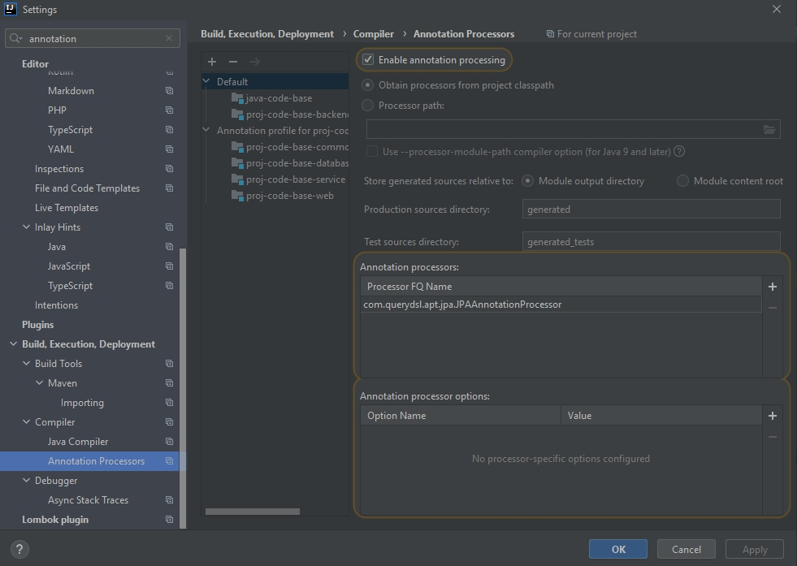

# Spring framework AOP
## Tools setup
1. Create project base folder at `c:\Projects\java-code-base`. We will call this path as `<PROJECT_DIR>` later
   You can change to your expected folder base later
   
2. Install necessary tools for development into `<PROJECT_DIR>\tools`
    - Download the tools from the following links : 
        1. Maven latest version: https://maven.apache.org/download.cgi
        2. OpenJDK 11: https://ci.elcanet.local/artifactory/prj_sso_generic_public/jdk/adoptopenjdk/11/windows/
		   Other versions can be downloaded at https://ci.elcanet.local/artifactory/prj_sso_generic_public/jdk/adoptopenjdk/
		   We use the OpenJDK versions hosted by ELCA (8 & 11) for safety and security. In case your use an older/newer version (e.g. JAVA 12,13 or Oracle JDK) please check and download directly from AdoptOpenJDK page or Oracle page.
    - Copy and unzip Java OpenJDK into `<PROJECT_DIR>\tools\openjdk-<version>`

3. IntelliJ setup
	- Make sure `File > Project Structure ... > Project Settings > Project` set Project SDK & language to the expected JDK you installed above and Project compiler output set to target folder of maven compiler.
	- Make sure the following plugins are installed:
		+ Sonarlint. Please also make sure that your project links to the Sonar server so that the rules set can be synched.
		+ Lombok (Please note that IntelliJ version `2020.2` is not compatible with version `0.30-2020.1`)
		+ MapStruct Support
	- Make sure that you enable Annotation processing for <strong>ALL the necessary modules</strong> in the project.
	    
## Common commands in the project
### Build project
`mvn clean install -DskipTests -Pvn-dev`
### Run project
Create Spring boot configuration
- Main class : `vn.elca.codebase.CodeBaseDevModeWebApplication`
- Active profiles: `vn-dev`

## Exercise
1. Create an aspect TimingAspect: Calculate how long for each requests and each methods in Controller, Service, Repository and display in the following format:
~~~~
Methods: PersonnePermissionContext.getParentGroups(..)start execution
  |__Methods: GroupeRepositoryImpl.findAllActiveForCache()start execution
    |__Methods: GroupeRepositoryImpl.findAllActiveForCache()start execution
    |__/Methods: GroupeRepositoryImpl.findAllActiveForCache(), execution time: 37ms
  |__/Methods: GroupeRepositoryImpl.findAllActiveForCache(), execution time: 38ms
  |__Methods: GroupeRepositoryImpl.findAllActiveMembresForCache()start execution
    |__Methods: GroupeRepositoryImpl.findAllActiveMembresForCache()start execution
    |__/Methods: GroupeRepositoryImpl.findAllActiveMembresForCache(), execution time: 25ms
  |__/Methods: GroupeRepositoryImpl.findAllActiveMembresForCache(), execution time: 26ms
  |__Methods: PersonneRepositoryImpl.findAllActiveMembresByIdentifiantIamForCache(..)start execution
    |__Methods: PersonneRepositoryImpl.findAllActiveMembresByIdentifiantIamForCache(..)start execution
    |__/Methods: PersonneRepositoryImpl.findAllActiveMembresByIdentifiantIamForCache(..), execution time: 2ms
  |__/Methods: PersonneRepositoryImpl.findAllActiveMembresByIdentifiantIamForCache(..), execution time: 2ms
/Methods: PersonnePermissionContext.getParentGroups(..), execution time: 71ms
~~~~
2. Use AOP to filter/transform the result of the method or input param of a method with the following scenario:
   1. Add one additional property `secured` in Project entity.
   2. Ensure the project name is anonymized Replace project name with "******" when we load project with `secured` = true

   
